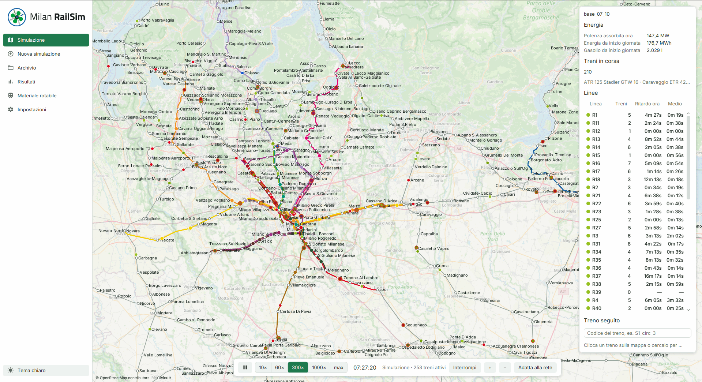
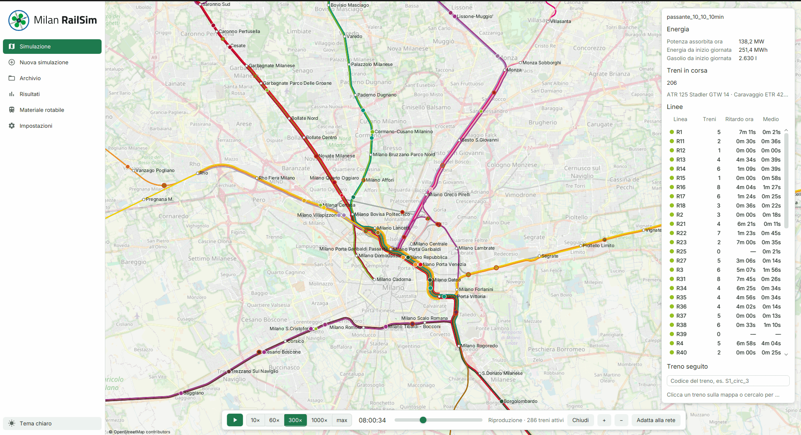
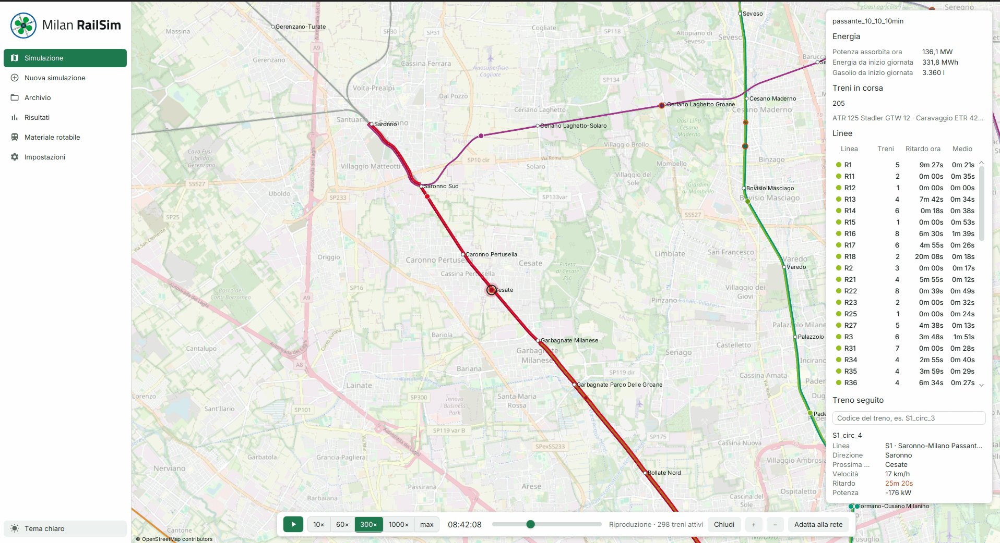
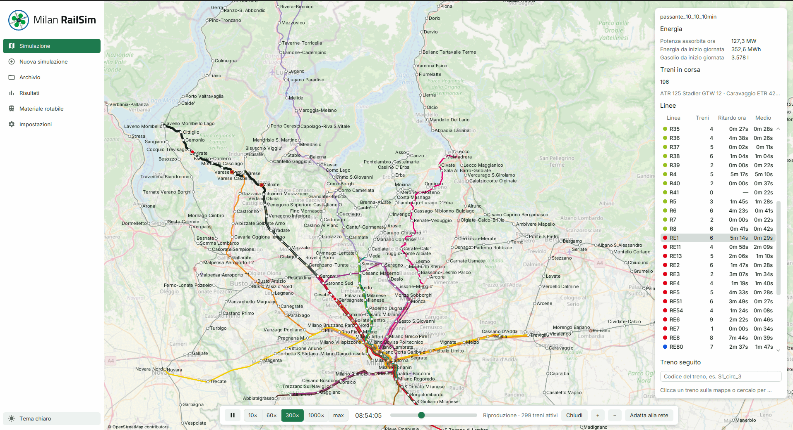
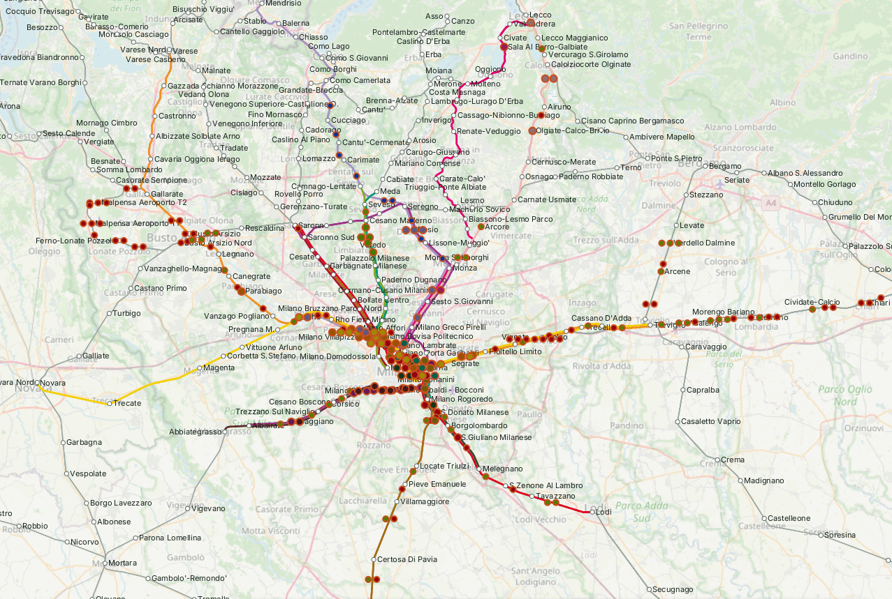
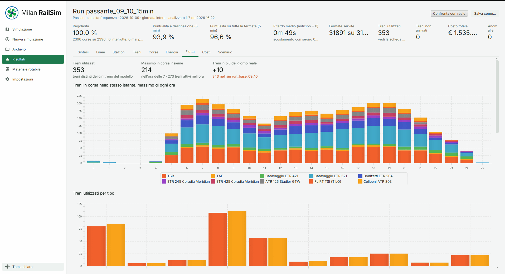
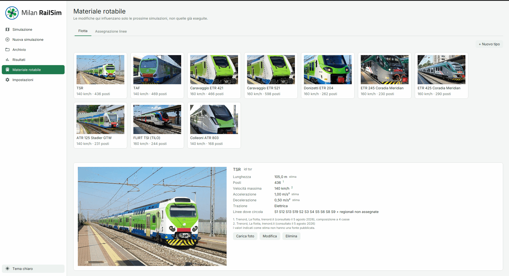
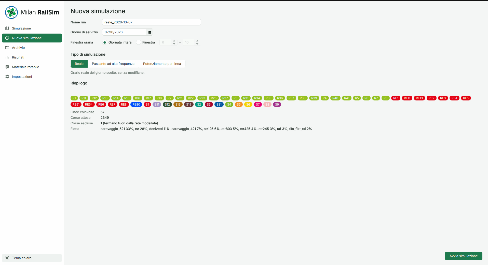
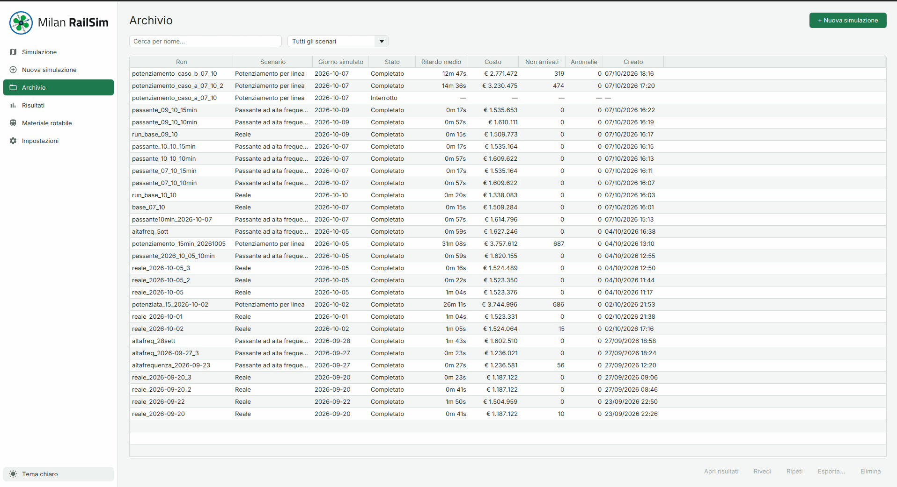
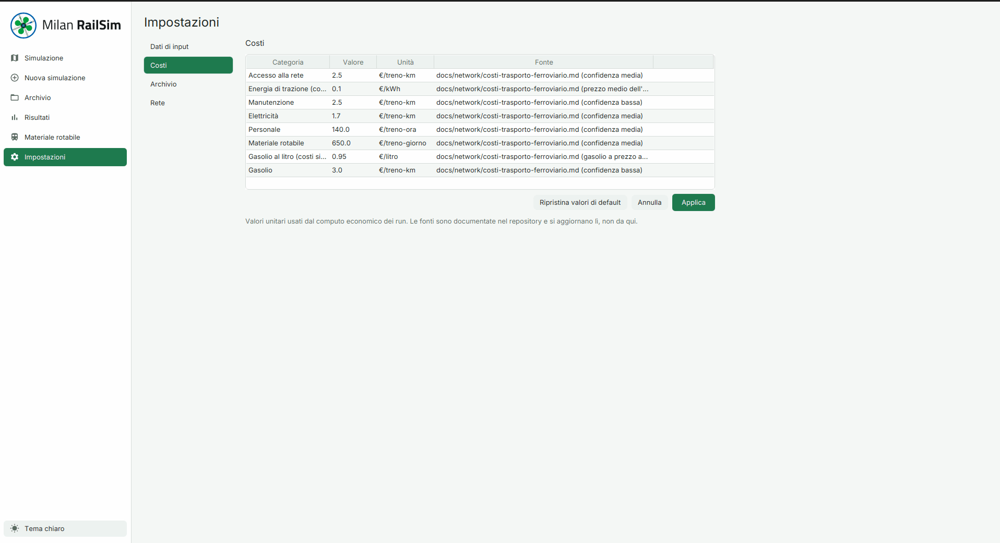

<p align="center">
  <picture>
    <source media="(prefers-color-scheme: dark)" srcset="assets/logo/logo_extended_dark.svg">
    
  </picture>
</p>

<p align="center">
  A desktop simulator of the suburban and regional railway network around Milan,
  built on <a href="https://github.com/matsim-org/matsim-libs/tree/main/contribs/railsim">railsim</a> and
  <a href="https://matsim.org">MATSim</a>.
</p>

<p align="center">
  <a href="https://github.com/fabiocompagnoni/milan_railway_network_simulation/actions/workflows/ci.yml"></a>
</p>



## What it is

Milan RailSim runs a full service day of the Trenord network (suburban S
lines, regional and RegioExpress lines) train by train, on a track-level model
of the infrastructure, and measures what happens: punctuality, energy, costs
and the trains the service needs.

It starts from the published timetable and answers one question: **how far can
the service be pushed towards higher frequencies before delays cascade, and
which parts of the network set that limit?** The real day is the reference;
two families of scenarios add trips on top of it.

Exam project for *Sistemi Complessi: Modelli e Simulazione*, Università degli
Studi di Milano-Bicocca.

## What it does

- **Simulates the real timetable** of any day in the Trenord GTFS feed, for the
  whole day or a time window.
- **Builds denser scenarios**: more trips through the Passante, the cross-city
  tunnel, at a target interval; or a target interval line by line.
- **Shows the simulation live** on a map: every train, its delay, the line it
  runs on, the power drawn by the network. A train can be followed and a line
  highlighted. A finished run can be replayed.
- **Analyses each run**: regularity and punctuality at five minutes, per line,
  station, train and trip; traction energy and diesel fuel; costs, as planned
  and as simulated; the fleet in use, by train type and by hour.
- **Compares a scenario with its real day**, including the trains it needs in
  addition.
- **Keeps every run** in an archive, with its scenario, its output and its
  charts, ready to be reopened or exported.

## Screenshots

| | |
|---|---|
|  |  |
| The Milan node at the morning peak | A train being followed: line, next stop, delay, power |
|  |  |
| One line highlighted on the network | A scenario pushed too far: trains stopped at the end of the day |
|  |  |
| Results of a run: the fleet in use, by type and by hour | The rolling stock catalogue |

<details>
<summary>The other pages</summary>

| | |
|---|---|
|  |  |
| New simulation: day, time window and scenario | The archive of the runs |
|  | |
| Settings: the unit costs | |

</details>

## The model

| | |
|---|---|
| Stations and junctions | 459 nodes and 1195 links at line level |
| Track level | 6008 nodes and 11452 links: platforms, sidings, crossovers, single-track sections |
| Service | 57 lines and about 2350 trips on a weekday |
| Rolling stock | 10 train types, with length, seats, speed, acceleration and traction |

The network is described at two scales. Lines between stations come from
OpenStreetMap; the stations and junctions that matter for capacity are declared
by hand, track by track, in `data/nodes`, and expanded into the detailed
network the engine runs on.

Train movement, block occupation and conflict resolution are railsim's. On top
of it the project adds:

- station tracks as interchangeable resources, so that a train finding its
  platform taken uses a free one (`railsim/StationTrackResources`);
- a deadlock avoidance for single-track lines
  (`railsim/SingleTrackDeadlockAvoidance`);
- timetable generation from the GTFS feed, with train circulations and the
  scenarios that add trips (`schedule/`);
- the analysis of a run (`results/`): punctuality indicators, the energy
  model, costs, fleet;
- the desktop application (`gui/`) and the process that feeds it while the
  simulation runs (`server/`).

## Install

Packages for Linux (`.deb`), Windows (`.exe`) and macOS (`.dmg`) are attached
to the [releases](https://github.com/fabiocompagnoni/milan_railway_network_simulation/releases).
They bundle a Java runtime: nothing else is needed.

**Linux** (Debian, Ubuntu and derivatives)

```bash
sudo apt install ./milanrailsim_*.deb
```

The application is installed under `/opt/milanrailsim`, with an entry in the applications menu.

**Windows**

Run `MilanRailSim-<version>.exe`. The installer needs no administrator rights:
it installs for the current user and adds a Start menu entry and a desktop
shortcut. The installer is not signed, so SmartScreen may show a warning:
*More info*, then *Run anyway*.

**macOS** (Apple Silicon)

Open `MilanRailSim-<version>.dmg` and drag the application into
*Applications*. The application is not signed, so the first launch is blocked:
allow it from *System Settings › Privacy & Security › Open Anyway*, or remove
the quarantine flag:

```bash
xattr -dr com.apple.quarantine /Applications/MilanRailSim.app
```

On every platform a jar is attached as well
(`milan-railsim-gui-<platform>.jar`), for running with an installed JDK 25:
it must be started from a copy of this repository, where it reads its data.

```bash
java -jar milan-railsim-gui-linux.jar
```

## Build from source

Requirements: **JDK 25** and **Maven** 3.8 or later.

MATSim and its railsim contrib are used at version `2027.0-SNAPSHOT`, which is
not published: they are built once into `~/.m2` from the commit the project is
pinned to.

```bash
git clone https://github.com/matsim-org/matsim-libs.git
cd matsim-libs
git checkout 31f4e54e39b94e3e01e348c99207618145174596
mvn -pl contribs/railsim,contribs/application -am install -DskipTests
```

Then, from this repository:

```bash
mvn javafx:run                    # start the application
mvn test                          # run the tests
mvn -DskipTests verify -Pdist     # build the package of this platform in target/dist/
```

`jpackage` builds only for the system it runs on. Windows needs
[WiX Toolset 3.x](https://wixtoolset.org) on the `PATH`, macOS the Xcode
command line tools.

## Using it

1. **Nuova simulazione**: choose the day, the time window and the scenario,
   then start.
2. **Simulazione**: watch the run; speed, pause and zoom are in the bar at the
   bottom.
3. **Risultati**: open the run when it ends. Each tab can be compared with the
   real day of the same date.
4. **Archivio**: reopen, replay, repeat, export or delete a run.

Everything the application writes is under `~/MilanRailSim`:

| Folder | Content |
|---|---|
| `runs/<name>/` | one simulation: `scenario/` (generated timetable and vehicles), `output/` (MATSim and railsim output), the analysis as CSV and JSON files, `charts/`, the recording used by the replay |
| `config/` | imported GTFS feed, unit costs, rolling stock catalogue with its photos |
| `cache/tiles/` | map tiles |

The project data are read-only: the application never writes in its own
folder.

## Repository layout

```
src/main/java/it/unimib/milanrailsim/
  network/     network construction, rolling stock catalogue
  schedule/    timetable from GTFS, circulations, scenarios
  railsim/     extensions of the railsim engine
  server/      simulation process and live frames
  results/     analysis of a run and its charts
  runs/        reading and comparing archived runs
  gui/         JavaFX application
scenarios/milan/    network and configuration the engine runs
data/nodes/         stations and junctions declared track by track
data/scenarios/     scenario definitions, energy parameters
data/osm/           OpenStreetMap extractions and the scripts that made them
data/trains/        photos of the train types
orari_trenord/      Trenord GTFS feed
docs/               documentation of the model
assets/             logo and packaging resources
```

## Documentation

The documents are in Italian.

| Document | Subject |
|---|---|
| [`docs/network/infrastruttura-nodo-milano.md`](docs/network/infrastruttura-nodo-milano.md) | the network: sources, modelling choices, station by station |
| [`docs/network/materiale-rotabile.md`](docs/network/materiale-rotabile.md) | train types, fleet in service, assignment to the lines |
| [`docs/network/modello-energetico.md`](docs/network/modello-energetico.md) | the energy model and its parameters |
| [`docs/network/costi-trasporto-ferroviario.md`](docs/network/costi-trasporto-ferroviario.md) | unit costs, trains used and trains added |
| [`data/nodes/README.md`](data/nodes/README.md) | how a station or a junction is declared |
| [`data/scenarios/README.md`](data/scenarios/README.md) | how a scenario is defined |
| [`docs/docs_matsim/`](docs/docs_matsim) | railsim reference: network, trains, events, deadlock avoidance |

## Limits

- The simulation is deterministic: no failures, no passengers, no external
  disturbance. Simulated punctuality is an upper bound of the real one.
- Trains drive at the highest speed allowed and brake as late as possible,
  which real drivers do not: diesel consumption is calibrated for this.
- Train circulations are those of the model, line by line; they are not the
  operator's rosters.
- When a scenario exceeds the capacity of a section the trains can stop for
  good. That the scenario is not feasible is a result; that the stall never
  clears is a property of the model.

## Data and credits

- Timetable: [Trenord](https://www.trenord.it) GTFS feed.
- Infrastructure and map: © [OpenStreetMap](https://www.openstreetmap.org/copyright) contributors.
- Engine: [MATSim](https://matsim.org) and its railsim contrib. Reference:
  I. Kaddoura, M. Unterfinger, T. Hettinger, C. Rakow, M. Rieser, *A
  large-scale hybrid micro- and mesoscopic simulation approach for railway
  operation*, Procedia Computer Science 238, 2024, 714–721,
  [doi:10.1016/j.procs.2024.06.082](https://doi.org/10.1016/j.procs.2024.06.082)
  ([`docs/paper/`](docs/paper)).

## Development

Work happens on `feature/*` branches, merged into `main`. Every push runs the
tests (`.github/workflows/ci.yml`). A tag `v<version>` runs
`.github/workflows/release.yml`, which builds the jar and the package on
Linux, Windows and macOS and attaches them to a GitHub Release; started by
hand, it only builds the artifacts.
